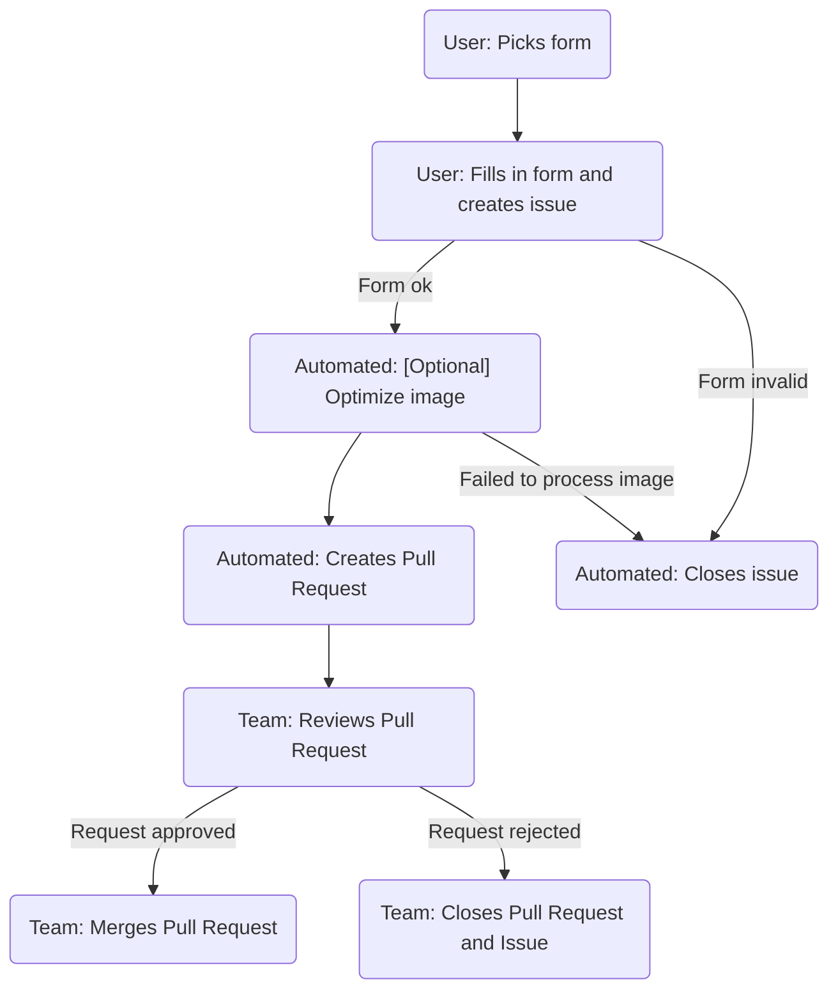

# Token Lists

CoW Swap default token lists and token image repository

## Managing the tokens

The process has been automated, and it's now much simpler.
The forms are self-explanatory and should contain all the info you need to proceed.

**Notes**:

- Images will be optimized in the background
- If you want to add a token/image to multiple networks, create one issue per network

Head to the [issues section](https://github.com/cowprotocol/token-lists/issues/new/choose) and pick your action:

### Add or update token

For adding tokens to CoW Swap's default token list, or to update an existing one, use the [`Add Token` form](https://github.com/cowprotocol/token-lists/issues/new?assignees=&labels=addToken&projects=&template=1-addTokenForm.yml&title=%5BAddToken%5D+%60SYMBOL%60+on+%60NETWORK%60).

### Remove token from the list

Use the [`Remove Token` form](https://github.com/cowprotocol/token-lists/issues/new?assignees=&labels=removeToken&projects=&template=3-removeTokenForm.yml&title=%5BRemoveToken%5D+%60SYMBOL%60+on+%60NETWORK%60).

Even though the token is removed from the default list, its image will be kept.

### Add or update image only

Not all tokens should be in the default token list, but the more token images we have the better UX.

For this, use the [`Add Image` form](https://github.com/cowprotocol/token-lists/issues/new?assignees=&labels=addImage&projects=&template=2-addImageForm.yml&title=%5BAddImage%5D+%60SYMBOL%60+on+%60NETWORK%60).

### Flow overview



## Development

Instructions for setting up and running the various scripts locally

### Setup

### Prerequisites

Currently runs on Node.js LTS/Gallium v16.20.2

```bash
# Install dependencies
yarn

# Generate Coingecko list
yarn coingecko
```

### Download images (deprecated)

There's a script that will fetch all images form the CowSwap list and store them in `src/public/images/<chainId>/<address>.png`

```bash
yarn downloadImages
```

### Generating Auxiliary Token Lists

To generate updated token lists from Coingecko and Uniswap:

```bash
yarn generateAuxLists
```

This script fetches and processes token data from both Coingecko and Uniswap APIs to create auxiliary token lists. These lists are used to enhance token metadata and support across different networks.

- Coingecko lists contain up to the top 500 tokens per chain, sorted by volume
- Uniswap lists are a combination of:
  - Token for given chain already existing in the default Uniswap list
  - Mainnet tokens, mapped to the target chain, via Coingecko api

The version and timestamp are bumped according to [token list standard](https://github.com/Uniswap/token-lists?tab=readme-ov-file#semantic-versioning).

#### Required Environment Variables

- `COINGECKO_API_KEY`: Your Coingecko API key (required for API access)

#### Generated Files

The script generates token list files in `src/public/` for the following networks:

- Ethereum (CoinGecko.1.json)
- Arbitrum (CoinGecko.42161.json, Uniswap.42161.json)
- Avalanche (Coingecko.43114.json, Uniswap.43114.json)
- Base (CoinGecko.8453.json, Uniswap.8453.json)
- Gnosis Chain (CoinGecko.100.json, Uniswap.100.json)
- Polygon (CoinGecko.137.json, Uniswap.137.json)
- Avalanche (CoinGecko.43114.json, Uniswap.43114.json)
- Lens (CoinGecko.232.json)
- BNB (CoinGecko.56.json, Uniswap.56.json)
